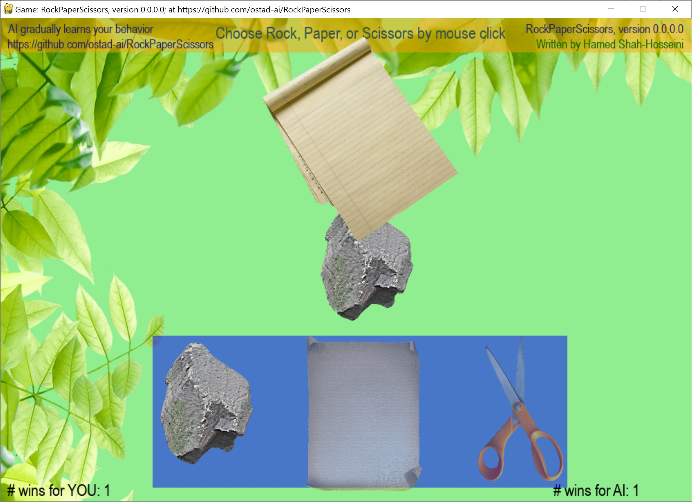

# RockPaperScissors
This is the classic **rock-paper-scissors** game that is played between two people. But this time, you play against AI. The AI gradually learns your behavior as you play the game. You pick your choice by clicking on one of the three items. Then, the AI without knowing your new choice reveals its choice.
We know that **paper** beats **rock**, **rock** beats **scissors**, and **scissors** beats **paper**.
1. Use **Mouse wheel** or **touchpad** to move the cursor over the items. Then, click by *mouse button* on your choice.
2. The game has some special effects for destruction of each item.
## This archive includes the executable program: **rps.exe**, which is suitable for **Windows 10** and over. You should click on the executable to run.
[Download the archive for win64](https://drive.google.com/file/d/19_3ZSbdHN88HcuFVihYLqyZYFxcCtAx0/view?usp=sharing)
---
 *Figure 1: A snapshot of RockPaperScissors Game, version 0.0.0.0, while playing the game.*
---
